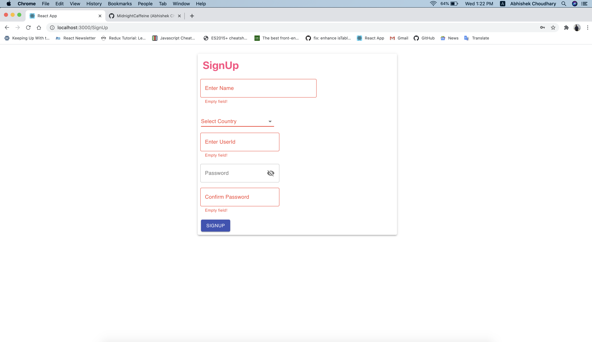
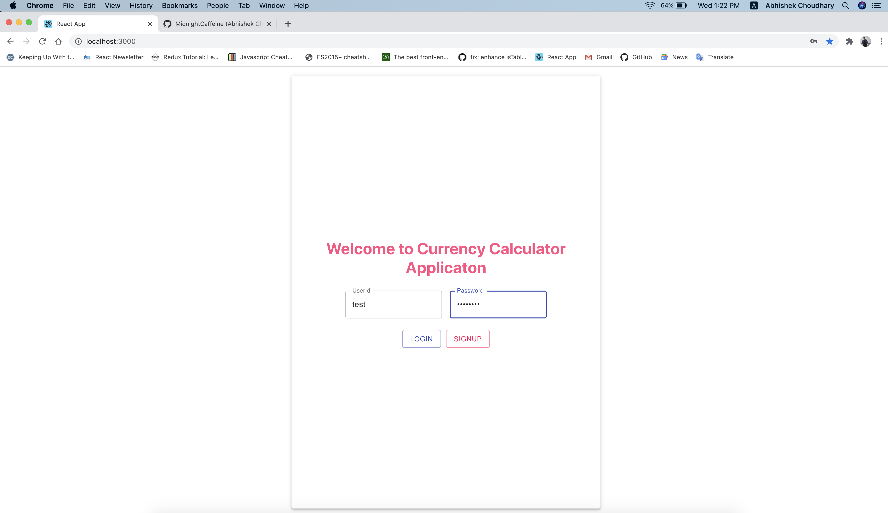
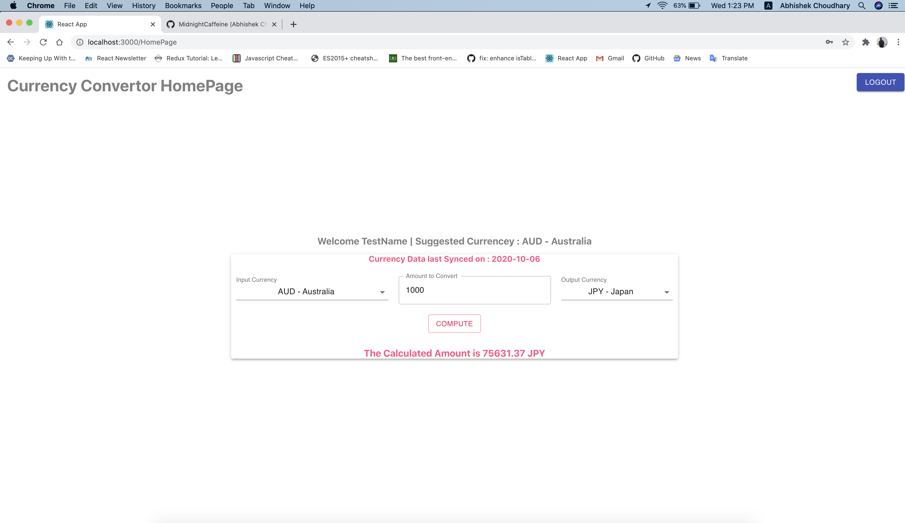

## MERN Example (Currency converter app)

* This is a third part of our currency converter application.
* In the first part [REPO] (https://github.com/MidnightCaffeine/react_router_hooks_ex) we created currency convertor using only react with hooks.
* In the Second part [REPO] (https://github.com/MidnightCaffeine/react_redux_hooks_ex) we created currency convertor using react redux with hooks.
* In this we have used MERN to create the similar app.
* M - MongoDb used to Store sign up data
* E - Express used to Create a service for add and get data from db for signup and login respectively.
* R - React with Redux (Hooks) is been used for UI (Login, Signup & Homepage)
* N - Node js not mainly used but will be utilzed for authentication in backend
-------------------------------------
* From login page you need to signup. Once signup done you can login.
* After login it lands to HomePage. Which is a basic currency converter,
* Takes input currency, amount to be converted and output currency from user.
* Uses Currency Convertor [API] (https://api.exchangeratesapi.io/latest)
* Logut Button to route back to login page.
* Contains basic validation in all pages.
-------------------------------------

#### To start with react app (localhost:3000)
* From Root Dir first Run [npm install] and then [npm start]

#### To start the server (localhost:5000)
* From Backend Dir run [npm install], make sure nodemon install globally else run [npm i -g nodemon]
* Launch server by running the command [nodemon server]

## Some Screenshot from the app 

#### Signup
#### Login
#### HomePage
---------------------------------------

---------------------------------------

---------------------------------------

---------------------------------------

---------------------------------------